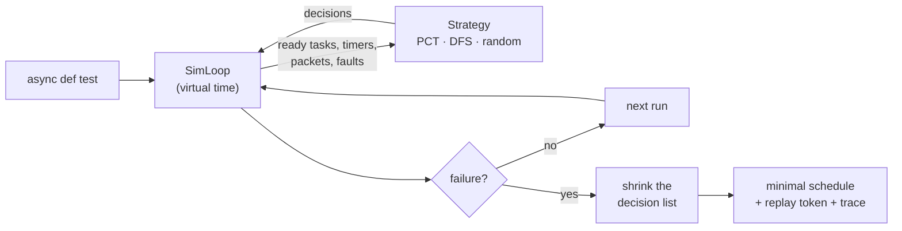

<div align="center">

# detangle

**Deterministic simulation testing for Python asyncio.**

Find the race conditions, deadlocks and cancellation bugs hiding in your async code.<br>
Get them back as a *minimal*, *exactly replayable* schedule.

[](https://github.com/louistarwars/Detangle/actions/workflows/ci.yml)


[](LICENSE)

</div>

---

Your async test suite runs every test in **one** timeline: the order asyncio happens to pick,
with a perfect network, a perfect database and no timeouts. Production runs it in millions of
others. That is where the bugs are.

**detangle** runs your `async def` code on a deterministic event loop that it fully controls.
It replays the same test hundreds of times, and each run explores a different, realistic
"what if": another task wins the race, a timer fires late, a TCP packet is split in two, the
network partitions, a timeout hits at the worst possible `await`. When something breaks, it
**shrinks** the failure to the simplest schedule that still triggers it and hands you a short
token that replays it **bit for bit**, on any machine.

It is the approach that FoundationDB, TigerBeetle and Antithesis made famous, packaged for
everyday Python: no dependencies, no code changes, a pytest plugin, and virtual time so
sleeps cost nothing.

```bash
pip install detangle
```

## 30-second tour

This test passes with `asyncio.run`, with pytest-asyncio, on your laptop and in CI. Every time.

```python
import asyncio
import detangle


class OrderService:
    def __init__(self, events):
        self.events = events

    async def create(self, order_id):
        await asyncio.sleep(0.005)          # database write
        self.events.append(("created", order_id))

    async def ship(self, order_id):
        await asyncio.sleep(0.005)          # database write
        self.events.append(("shipped", order_id))


@detangle.test
async def test_order_lifecycle():
    events = []
    service = OrderService(events)
    await asyncio.gather(service.create(42), service.ship(42))
    assert events[0] == ("created", 42), f"consumers saw {events}"
```

Under detangle it fails on the second run, because in production the "ship" write can finish first:

```text
detangle found a bug in test_orders.test_order_lifecycle after 2 runs [random(seed=40222063875785)]

  AssertionError: consumers saw [('shipped', 42), ('created', 42)] ...
    at test_orders.py:23 in test_order_lifecycle: assert events[0] == ("created", 42), f"consumers saw {events}"

Minimal failing schedule: 1 deviation from asyncio's default behaviour (shrunk from 3 in 5 replays).

Interleaving (* = the scheduler deviated from asyncio's FIFO order here):
     1   0  test_order_lifecycle    spawn   OrderService.create#2  test_orders.py:22  | await asyncio.gather(...)
     2   0  test_order_lifecycle    spawn   OrderService.ship#3    test_orders.py:22  | await asyncio.gather(...)
     3   0  test_order_lifecycle    await   test_orders.py:22  | await asyncio.gather(...)
     4   0  OrderService.ship#3   * await   sleep  test_orders.py:14  | await asyncio.sleep(0.005)  # database write
                                  ^ ran ahead of OrderService.create#2
     5   0  OrderService.create#2   await   sleep  test_orders.py:10  | await asyncio.sleep(0.005)  # database write
     6 5ms  OrderService.ship#3     return
     7 5ms  OrderService.create#2   return
     8 5ms  test_order_lifecycle    raise   AssertionError: consumers saw [('shipped', 42), ('created', 42)]

Reproduce this exact run:
    DETANGLE_REPLAY=dt1-cgAB pytest "test_orders.py::test_order_lifecycle"
    detangle.replay(test_order_lifecycle, "dt1-cgAB")
```

The whole exploration (dozens of runs, shrinking, replay) takes a fraction of a second: time is
virtual, so `asyncio.sleep(3600)` returns instantly while `loop.time()` still advances by an hour.

## What it finds

| Bug class | How detangle exposes it |
| --- | --- |
| **Races and ordering bugs** (check-then-act across `await`, lost updates, events out of order) | Explores which ready task runs next, using PCT, random walks or an exhaustive bounded search. |
| **Deadlocks** | Detects that nothing can make progress, then reports each blocked task, the lock it waits for, **who holds it**, and the wait-for cycle. |
| **Cancellation-safety bugs** (leaked connections or locks, half-applied updates) | `detangle.maybe_timeout()` lets the explorer choose the exact `await` a timeout hits. |
| **Hangs and lost wake-ups** | "`worker#3` waits for Event `ready` to be set (nothing left can set it)". |
| **Livelocks and retry storms** | Step and virtual-time budgets (`max_steps`, `max_time`). |
| **Silent background crashes** | Exceptions in tasks that nobody awaited, and exceptions in callbacks, fail the test. |
| **Protocol and framing bugs** | TCP writes coalesced and split into several reads; datagrams lost, duplicated or reordered. |
| **Distributed-systems bugs** | Partitions, crashes and restarts, message loss, plus a linearizability checker (Jepsen-style) for your histories. |
| **Broken invariants** | `detangle.invariant(check)` runs *after every scheduling step*, not just at the end. |

## Features

- **Drop-in.** `SimLoop` is a real `asyncio.AbstractEventLoop`. Tasks, `gather`, `wait_for`,
  `timeout`, `TaskGroup`, locks, queues, events, async generators, `to_thread`, contextvars and
  eager tasks all work. In default order it reproduces asyncio's scheduling **exactly**, and the
  test suite checks this against the real event loop.
- **Virtual time.** `detangle.run(main)` is `asyncio.run` with an instant clock. Test a
  10-minute exponential backoff in under a millisecond.
- **Smart exploration.** Strategies include `PCT` (probabilistic concurrency testing, with
  guaranteed detection probability for bugs of bounded depth), `RandomWalk`, `DFS` (exhaustive,
  delay-bounded: *"no bug with ≤ k deviations exists"*), `FIFO` and `Replay`. The default
  `auto` portfolio mixes them.
- **Shrinking.** Hypothesis-style minimisation of the failing schedule: you debug *one* context
  switch, not forty.
- **Perfect replay.** Every source of nondeterminism is a recorded decision. A failure is a
  token like `dt1-cgAB` that reproduces it exactly, including network latencies, injected
  faults, and `random` values drawn by your code.
- **Simulated network.** Unmodified `asyncio.open_connection` / `start_server` /
  `create_datagram_endpoint` code runs over an in-memory network with latency,
  fragmentation, loss, duplication, partitions, host crashes and restarts. There is also a
  `Mailbox` API for prototyping protocols such as Raft or Paxos.
- **Linearizability checking.** A Wing & Gong / Lowe search with P-compositionality, like
  Knossos and Porcupine, with ready-made models (register, KV, queue, set, counter, mutex) and
  support for operations of unknown outcome.
- **Great failure reports.** A readable interleaving trace, deadlock wait-for graphs,
  linearizability counterexamples with a timeline, and an interactive HTML report.
- **Regression database.** Failing schedules are saved to `.detangle/` and replayed first on
  the next run, so a bug found once keeps failing until it is really fixed.
- **Tooling.** A pytest plugin (marker, decorator, `--detangle-*` options), a CLI
  (`detangle explore|replay|decode`), JSON output, strict typing, and zero dependencies.

## Usage

### With pytest

```python
import detangle, pytest

@detangle.test                                   # 200 schedules by default
async def test_transfer(): ...

@detangle.test(runs=2000, strategy="pct:3", timer_jitter=0.01)
async def test_harder(): ...

@pytest.mark.detangle(runs=500)                  # no import needed: the plugin handles async tests
async def test_marked(tmp_path): ...             # fixtures work
```

```bash
pytest --detangle-runs=5000                      # explore more (e.g. nightly)
pytest --detangle-seed=1234                      # reproducible exploration
pytest --detangle-replay=dt1-cgAB tests/test_orders.py::test_order_lifecycle
pytest --detangle-report-dir=reports             # interactive HTML report per bug
```

### Without pytest

```python
stats = detangle.explore(my_async_fn, runs=1000)          # raises detangle.BugFound
result = detangle.run(my_async_fn)                        # like asyncio.run, virtual time
result = detangle.run(my_async_fn, seed=7)                # one random schedule, reproducible
detangle.replay(my_async_fn, "dt1-cgAB")                  # re-run a failure with a full trace
```

```bash
detangle explore tests/test_orders.py:test_order_lifecycle --runs 1000
detangle replay dt1-cgAB tests/test_orders.py:test_order_lifecycle --html report.html
```

### Prove the absence of bugs (within a bound)

```python
stats = detangle.explore(fixed_version, strategy=detangle.DFS(max_delays=3), runs=100_000)
assert stats.exhausted   # every schedule with at most 3 deviations was checked
```

### Timeouts at the worst moment

```python
async def client():
    try:
        await detangle.maybe_timeout(pool.query("SELECT 1"))   # may be cancelled at any await
    except TimeoutError:
        pass

await asyncio.gather(*(client() for _ in range(4)))
assert pool.in_use == 0, "connection leaked on timeout"
```

### Invariants after every step

```python
detangle.invariant(lambda: accounts.total() == 1_000, "money is conserved")
```

### A network that fights back

```python
@detangle.test(net={"latency": (0.001, 0.05), "fragment": 0.3, "drop": 0.01})
async def test_replication():
    net = detangle.network()
    primary = detangle.spawn(run_server(), host="db-1")      # tasks run on simulated hosts
    replica = detangle.spawn(run_replica(), host="db-2")
    reader, writer = await asyncio.open_connection("db-1", 5432)   # unmodified asyncio code
    ...
    net.partition(["db-1"], ["db-2"])                           # split brain
    net.crash("db-1"); net.restart("db-1")                      # kill -9 and reboot
    net.heal()
```

### Linearizability (Jepsen in a unit test)

```python
history = detangle.History()

async def client(name):
    await history.call(name, "put", ("x", 1), kv.put("x", 1))
    await history.call(name, "get", "x", kv.get("x"))

await asyncio.gather(*(client(f"c{i}") for i in range(3)))
history.assert_linearizable(detangle.lin.KV())
```

```text
NotLinearizable: history is not linearizable with respect to the kv model
  longest linearizable prefix (4 of 9 operations):
      1. 'c2': get('x') -> None
      2. 'c2': put('x', 'c2-1') -> None
      ...
  no valid ordering can explain: 'c2': get('x') -> None (invoked at event 7, returned at event 8)
  timeline (real-time order, left to right; > = never returned):
    'c0' [-----------1-----------]  [---6----]  [---8----]
    'c1'    [------------2-------------]  [---7----]  [--9--]
    'c2'       [3-]  [4-]  [5-]
```

### Nondeterministic test inputs

```python
size = detangle.randint(1, 10)          # explored by the strategy, shrunk towards 1
mode = detangle.choice(["fast", "safe"])
delay = detangle.uniform(0, 0.1)
detangle.shuffle(requests)
```

## How it works



asyncio runs *handles*, and every step of every task is one. `SimLoop` puts ready handles into
**lanes** (one per task, one for plain callbacks, one per executor job). Whenever more than one
lane can run, it asks a **strategy**. Answer `0` means "what asyncio would do", so a run of all
zeros *is* stock asyncio. Timer jitter, network latency, packet loss, fragmentation, injected
cancellations and your own `detangle.choice()` calls are decisions too.

A run is therefore fully described by its list of integers. Replaying the list reproduces the
run. Shrinking the list, while keeping the same failure, simplifies the bug. Enumerating lists
with a bounded sum explores all schedules with at most *k* deviations. The details are in
[docs/how-it-works.md](docs/how-it-works.md).

## How it compares

| | detangle | plain asyncio / pytest-asyncio | trio `MockClock` | Hypothesis | Loom / Shuttle (Rust) | Coyote (.NET) | Jepsen |
|---|:-:|:-:|:-:|:-:|:-:|:-:|:-:|
| Target | Python asyncio | Python | Python trio | Python | Rust | C# | any (black box) |
| Controls task interleavings | ✅ | ❌ | ❌ | ❌ | ✅ | ✅ | ❌ (real concurrency) |
| Virtual time | ✅ | ❌ | ✅ | ❌ | ❌ | partly | ❌ |
| Exact replay of a failure | ✅ token | ❌ | ❌ | ✅ inputs | ✅ | ✅ | ❌ |
| Shrinks failing schedules | ✅ | ❌ | ❌ | inputs only | ❌ | ❌ | ❌ |
| Bounded exhaustive search | ✅ DFS | ❌ | ❌ | ❌ | ✅ | ✅ | ❌ |
| Simulated network and faults | ✅ | ❌ | ❌ | ❌ | ❌ | ❌ | ✅ (real network) |
| Linearizability checker | ✅ | ❌ | ❌ | ❌ | ❌ | ❌ | ✅ |
| Runs as a unit test, in milliseconds | ✅ | ✅ | ✅ | ✅ | ✅ | ✅ | ❌ |

## Honest limitations

- **Simulated I/O only.** Real sockets, subprocesses and signal handlers raise
  `detangle.RealIOError`. Use asyncio streams or protocols (served by the simulated network),
  or fake the dependency. Clients built on asyncio streams work unchanged; libraries that open
  raw sockets do not.
- **Reordering is an over-approximation by design.** With `reorder=True` (the default),
  detangle assumes every `await` may take longer than usual, which is what real I/O does. For
  purely in-memory code, asyncio guarantees FIFO wake-ups, so a reported schedule might be one
  your production code can never hit. The report tells you exactly which deviation was needed.
  `reorder=False` keeps strict asyncio order and explores only time, network and faults.
- **Threads are simulated.** `to_thread` and `run_in_executor` jobs run on the loop thread, in
  their own lane. Code that spins its own threads is outside the model.
- **Determinism comes from your code too.** Replays are exact if the code under test gets
  randomness from `random` (seeded per run) or `detangle.*`, and time from the loop
  (`patch_time=True` also covers `time.monotonic()` and friends). Iterating over sets of
  objects hashed by `id()` can differ between processes; detangle warns when a replay diverges.
- **Speed.** About 100k scheduling steps per second in pure Python, so a few hundred runs of a
  typical test take well under a second.

## Documentation

- [Guide](docs/guide.md): every API, with examples
- [How it works](docs/how-it-works.md): lanes, decisions, strategies, shrinking, soundness
- [Simulated network](docs/network.md): TCP, UDP, mailboxes, partitions, crashes
- [Linearizability](docs/linearizability.md): recording histories and writing models
- [Examples](examples/): runnable scenarios, each with a bug and its fix
  ([bank race](examples/bank_race.py), [order events](examples/order_events.py),
  [dining philosophers](examples/dining_philosophers.py),
  [connection pool](examples/connection_pool.py), [cache stampede](examples/cache_stampede.py),
  [line protocol](examples/line_protocol.py), [replicated KV](examples/replicated_kv.py),
  [retry backoff](examples/retry_backoff.py))

## Roadmap

- Dynamic partial-order reduction (DPOR) to skip equivalent interleavings
- Native trio / AnyIO backends
- A simulated disk with `fsync` semantics (torn writes, lost unsynced data)
- Coverage-guided exploration (steer the strategy towards new interleavings)
- A GitHub Action that uploads HTML reports as artifacts
- Adapters for popular clients (Redis, PostgreSQL, HTTP) on top of the simulated network

Contributions are very welcome: see [CONTRIBUTING.md](CONTRIBUTING.md).

## License

[MIT](LICENSE)
